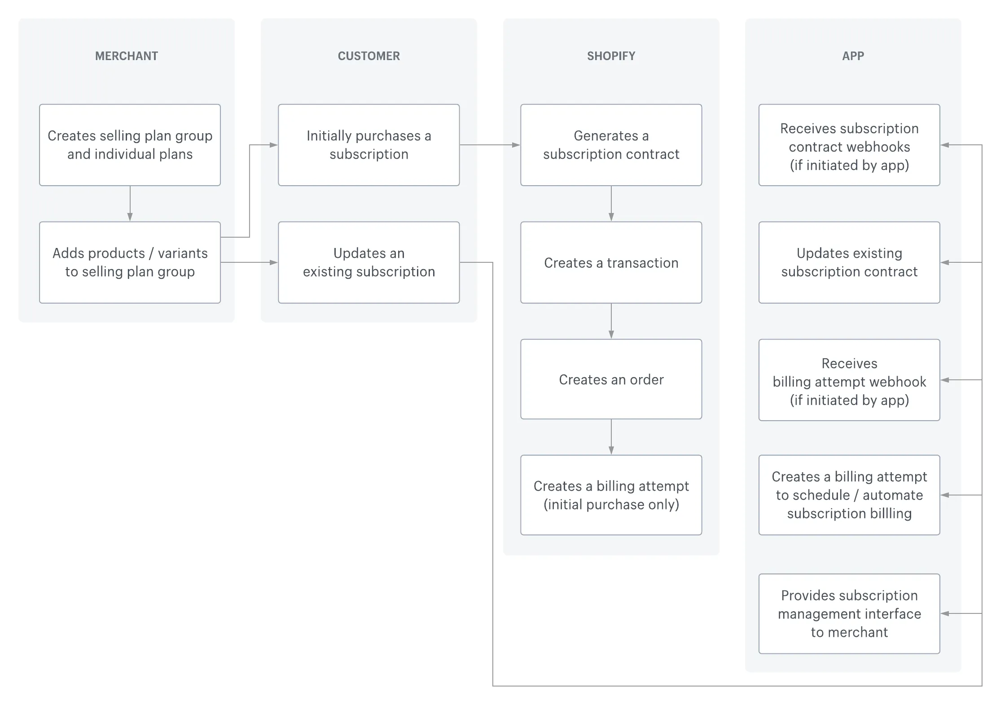

## Shopify App Subscribe And Save

- 定义 selling plans（订购省规则）
- 管理 subscription contracts（订阅合约）
- 使用 vault 的 payment methods 做自动扣款 / 重试

### Doc

**如果你需要对APP进行修改，请确保你已经阅读并掌握了以下文章内容！**

- [build-a-selling-plan](https://shopify.dev/docs/apps/build/purchase-options/subscriptions/selling-plans/build-a-selling-plan) 如何创建“订阅省”和“预付”销售计划，以及如何将产品与这些计划关联起来。
- [model-subscriptions-solution](https://shopify.dev/docs/apps/build/purchase-options/subscriptions/model-subscriptions-solution) Shopify 中的订阅功能是如何运作的。
- [subscriptions](https://shopify.dev/docs/apps/build/purchase-options/subscriptions) 订阅的定义、订阅 API、迁移到订阅 API 的方法以及订阅应用的局限性。
- [subscription-apps](https://shopify.dev/docs/apps/design/user-experience/subscription-apps) 主题中订购计划设计规范。
- [subscriptions-storefronts](https://shopify.dev/docs/storefronts/themes/pricing-payments/subscriptions) 在主题中使用订购计划组件。

### What is Subscribe And Save

- 按次付费订阅（Pay-per-delivery subscription）：
用户每次配送前付钱；每个周期会生成一张新订单，这就是常见的 “订阅 + 每次打折” 场景，也就是「订购省」。

在 Shopify 平台的订购省场景中涉及到这些核心概念：

1. Selling plans / Selling plan groups
   - 表示「商品可以怎样被售卖」的规则，比如：每月配送 1 次，享受 10% 折扣
2. Subscription contract（订阅合约）
    - 一旦客户在结账时选择了某个订阅 selling plan，Shopify 会创建一个 subscription contract：记录客户、商品、频率、价格、收货信息等
    - 后续的自动续费 & 续订订单，就是基于这个 contract 来生成 billing attempts 和订单。
3. Customer payment methods（支付方式）
   - 订阅要自动扣款，就需要「卡 / 支付方式」被安全地存起来。这由 Shopify 的 Customer payment method APIs 和 checkout vaulting 机制负责。

### Shopify 中的实现方式

### 可能涉及的 API

1. [Selling plan APIs](https://shopify.dev/docs/api/admin-graphql/latest/objects/sellingplan)（销售方案 API）
   - 用于创建 / 管理「订购省」的规则（频率、折扣、是否必须订阅、等）。
2. [Subscription contract APIs](https://shopify.dev/docs/api/admin-graphql/latest/objects/subscriptioncontract)（订阅合约 API）
   - 用于在客户完成首单后，管理后续的订阅生命周期：
     - 查询合同列表 / 明细
     - 修改合约（例如改配送地址 / 频率 / 暂停）
     - 驱动后续周期的收费和订单生成
3. [Customer payment method APIs](https://shopify.dev/docs/api/admin-graphql/latest/objects/customerpaymentmethod)（客户支付方式 API）
    - 首次结账时由 Shopify checkout 完成 payment method vaulting，之后 app 使用 API 读取信息并发起 billing attempts。

### App 架构

#### 生命周期

官方生命周期说明
- 商店创建订购计划 & 销售方式
- 顾客购买/更新订阅计划
- 当顾客购买订阅服务是，Shopify 会创建一笔交易，然后创建订单，最后生成一份订阅合同，并尝试对首次购买进行结算
- 订阅服务周期开始后的订单由 APP 处理， APP 根据现有的的订阅合同，通过 API 创建一次计费尝试（ Shopify 会同时生成一笔交易和一个订单）
- 当发生于订阅相关的事件时，APP 通过 webhook 接收回调，处理计费失败或者发货，并为客户用户管理订阅界面，为商店提供管理订阅用户界面。

APP 生命周期：
1. 商店后台配置「订购省」计划
   
   通过 GraphQL Admin API 的 Selling plan APIs 提供配置页 UI 
   - 为产品创建多种订阅方案（如「每月 1 次，95 折」「每两月 1 次，9 折」等）
   - 设置是否「仅限订阅」或「一次性购买 + 订阅可选」
   - 设置折扣、最低订阅周期等参数
   - 将订购计划关联到产品/变体

2. 商店前端（主题）
   
   - 【待定】如果存在额外的补充信息，则需要存储在本地数据库中，前端则需要通过接口/ extension 的方式渲染对应的组件；如果不需要额外的补充信息，前端通过 product.sellingPlan 渲染对应组件；
   - 客户选择某个订阅计划并提交加购/结算时需要额外携带对应的 sellingPlanId;
   - 通过 proxy / api + 主题代码的方式提供“管理我的订阅”页面
  
3. 客户下单 & 合约生成

    当客户在结算页中完成一笔带有 selling plan 的订单：
    1. Shopify 结算并创建 初始订单（包含首次订阅的商品）
    2. Shopify 根据 checkout 数据自动创建 Subscription contract
    3. Shopify 生成一个 初始 billing attempt（首次付款）
    4. 支付方式会被 vault 成 Customer payment method

    APP 通过监听 webhooks （非最终确定且 webhooks 随版本会有变化，请以 docs 为准）：
    - 合约创建 / 更新 / 状态变化
    - 计费尝试结果（成功 / 失败）
  
4. 续费 & 续订订单
    >
    > 定时任务
    >

    后续每一个周期，APP 或者后端 通过 Subscription contract APIs 完成：
    1. 根据 subscription contract 的 schedule 计算下一次计费时间
    2. 到时间后，调用 billing attempt 相关 API（例如 subscriptionBillingAttemptCreate）：
       - 指定 subscription contract
       - Shopify 使用 vault 的支付方式自动发起扣款
       - 成功 -> 生成新订单 (Order)
       - 失败 -> 触发 retry 策略、发送通知等

    同时可以在合约层面做一些调整：
    - 修改下一次配送日期 / 频率
    - 修改商品数量 / 替换变体
    - 暂停 / 恢复订阅
    - 取消合约
